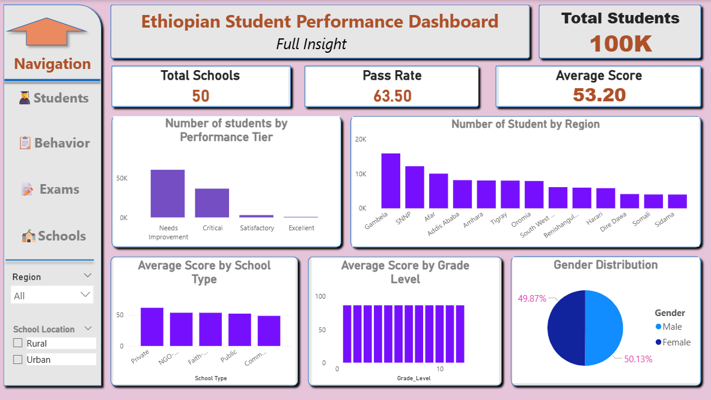
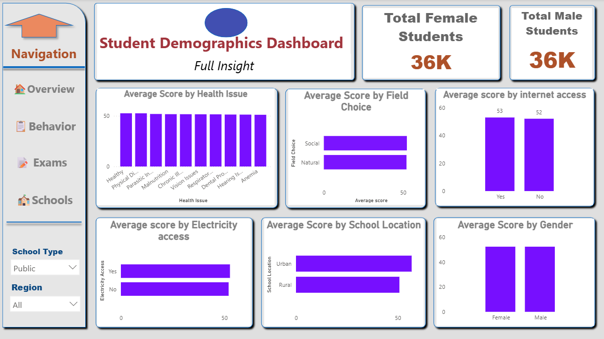
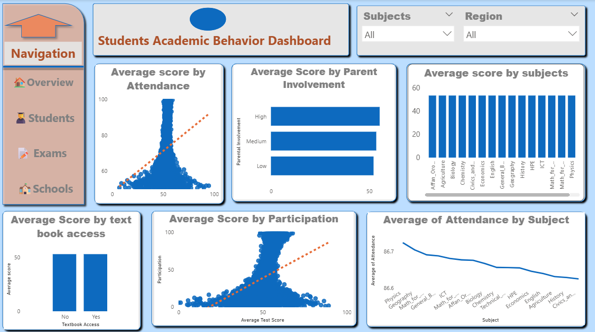
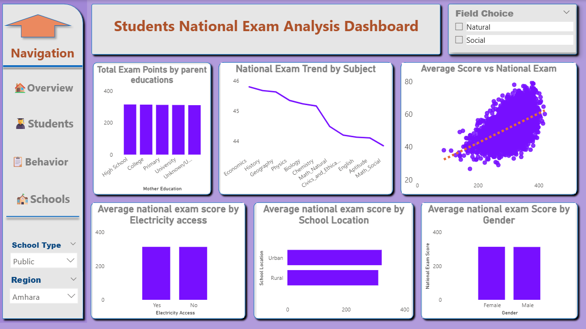
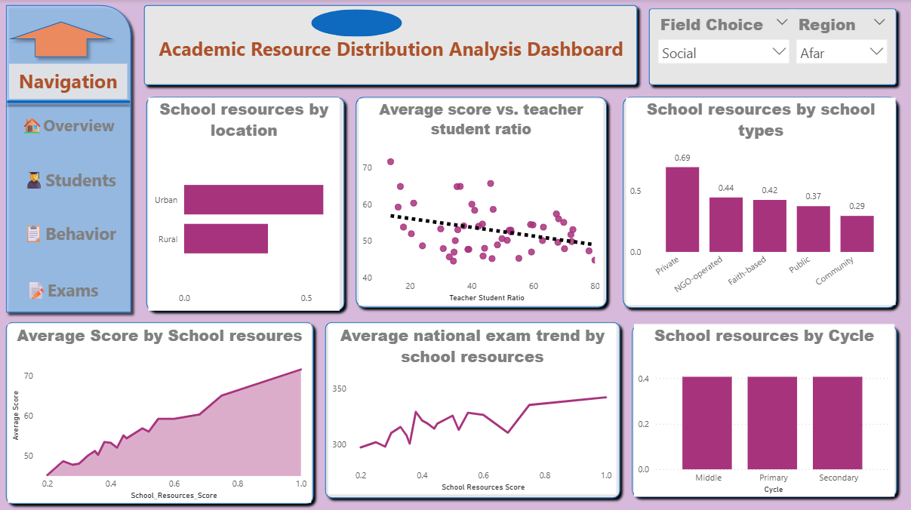

# 📊 Ethiopian Student Performance Analytics

---

## 📌 Project Overview

This research marks a **paradigm shift toward predictive analytics** in Ethiopian education, enabling early warning systems for at-risk students and providing a reusable Python codebase.

| Metric | Value |
|--------|-------|
| **Sample Size** | 100,000+ student records |
| **Features** | 634 attributes |
| **Regions** | 13 Ethiopian regions |
| **Dimensionality Reduction** | 96.7% (634 → 25-30 features) |
| **Memory Optimization** | 1,024MB → 27.5MB |

---

## 🎯 Key Achievements

| Achievement | Score |
|-------------|-------|
| **Overall Average R²** | **0.785** |
| **AUC Score** | **0.916** |
| **Accuracy** | **83.5%** |
| **Recall** | **77%** |
| **Precision** | **84%** |
| **MAE** | 2.99 |
| **RMSE** | 3.73 |

---

## 🖼️ Dashboard Preview Gallery

### 📊 Academic Performance Overview

*Figure 1: Comprehensive academic performance metrics including exam scores, and overall average score*

 

### 📊 Student Demographic Factor Impact Dashboard

*Figure 2: Analysis of demographic factors including age, gender, socioeconomic status, and regional differences*

 

### 🌐 Student Academic Behavioral Factor Impact Dashboard

*Figure 3: Behavioral impact analysis including parent involvement, attendance patterns, and engagement metrics*

 

### 👨‍👩‍👧 Students National Exam Analysis Dashboard

*Figure 4: National exam performance analysis with subject-wise breakdown and trend analysis*

 

### 📈 School Resources Factor Impact Analysis Dashboard

*Figure 5: School resources impact analysis including internet access, laboratory facilities, and teacher-student ratios*

---

## 🔑 Key Findings

| Rank | Feature | Impact | SHAP Value |
|:----:|---------|--------|------------|
| 1 | 🏫 **School Resources** | **67.8%** | Highest |
| 2 | 📚 **Student Engagement** | **17.8%** | High |
| 3 | ❤️ **Health Factors** | **5.2%** | Medium |
| 4 | 📊 **Attendance** | **4.5%** | Medium |
| 5 | ✏️ **Homework Completion** | **3.7%** | Medium |

### Major Insights

| Insight | Finding |
|---------|---------|
| **Educational Crisis** | 91% Grade 12 exam failure rate nationwide |
| **Out of School** | 9M+ children remain out of school |
| **Achievement Gap** | 27.7 percentage point math achievement gap |
| **Zero Pass Schools** | 1,200+ schools recorded zero passes |
| **Regional Gap** | 26.1 percentage point disparity between regions |
| **Conflict Impact** | Amhara, Tigray, Oromia face compounded challenges |

---

## 📁 Repository Structure
