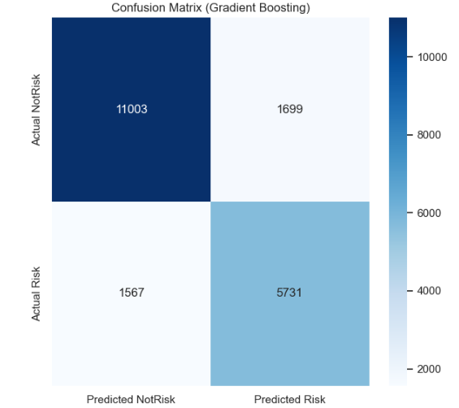

# 🇪🇹 Ethiopian Student Performance Analytics System

<div align="center">


<br/>


<br/>

> **A comprehensive data science framework developed at the Ethiopian Statistics Service (ESS) to transform large-scale educational data into actionable policy intelligence.**

<br/>

[](##)
[](##)
[](##)
[](##)
[](##)

</div>

---


## 📋 Table of Contents

<details>
<summary>Click to expand</summary>
  
- [🎯 Project Overview](#-project-overview)
- [⚠️ Problem Statement](#-problem-statement)
- [📊 Dataset Description](#-dataset-description)
- [🔧 Feature Engineering Pipeline](#-feature-engineering-pipeline)
- [🤖 Modeling Strategy](#-modeling-strategy)
- [📈 Results & Key Findings](#-results--key-findings)
- [🗺️ Regional Disparities](#-regional-disparities)
- [🖼️ Dashboard Gallery](#-dashboard-gallery)
- [📁 Repository Structure](#-repository-structure)
- [🚀 Getting Started](#-getting-started)
- [⚙️ Model Hyperparameters](#-model-hyperparameters)
- [📖 Feature Dictionary](#-feature-dictionary)
- [⚠️ Limitations](#-limitations)
- [💡 Recommendations](#-recommendations)
- [📚 References](#-references)
- [👤 Author & Acknowledgments](#-author--acknowledgments)

</details>

---

## 🎯 Project Overview

Ethiopia's education system serves over **26 million students** across regions with significant disparities. This project analyzes **100,000 Ethiopian students** across **634 attributes** spanning **Grades 1–12**, integrating academic, demographic, engagement, and institutional factors.

### 🏆 Performance Summary

<div align="center">

| Task | Model | Key Metric | Score |
|:----:|-------|-----------|:-----:|
| 📊 Overall Average Regression | Gradient Boosting | R² | **0.785** |
| 📝 National Exam Regression | Gradient Boosting | R² (log-scale) | **0.438** |
| 🚨 At-Risk Classification | Gradient Boosting | ROC-AUC | **0.916** |
| 👥 Student Segmentation | MiniBatchKMeans | Silhouette Score | **0.174** |

</div>

### 🌍 Ethiopian Education Crisis Context

| Crisis Indicator | Statistic |
|-----------------|-----------|
| 📉 Grade 12 national exam pass rate (2025) | **Only 8.4%** of 581,905 students |
| 🧒 Children out of school | **9M+** remain unenrolled |
| 📐 Math achievement gap | **27.7 pp** (Addis Ababa 62.4% vs Afar 34.7%) |
| 🏫 Schools with zero passes | **1,200+** recorded nationwide |
| 👨‍👩‍👦 Pupil-teacher ratio | **39:1** nationally |
| 📚 Primary gross enrollment | **>80%** but quality gaps persist |

---

## ⚖️ Problem Statement

Current educational frameworks struggle with **reactive** rather than **proactive** management. Authorities lack:

* **Early-Warning Systems:** No tools to identify at-risk students before critical national exams.
* **Feature Complexity:** 600+ raw variables create "noise," making it difficult to pinpoint the true drivers of student success.
* **Geospatial Equity:** Limited data-driven insight into regional disparities and resource allocation needs.

---

## 🎯 Project Objectives

To bridge these gaps, this system implements a multi-stage analytical framework:

1.  **High-Efficiency Pipeline:** Compressing 634 raw attributes into ~25 high-signal features (96.7% reduction).
2.  **Predictive Modeling:** Leveraging regression to forecast **Overall Academic Averages** and **National Exam Scores**.
3.  **Explainable AI (XAI):** Utilizing SHAP values to diagnose *which* behavioral and demographic factors impact outcomes.
4.  **Risk Segmentation:** Employing clustering and geospatial mapping to visualize regional vulnerability.
5.  **Evidence-Based Policy:** Transforming model insights into actionable intervention strategies.

---

## 📊 Dataset Description

### Dataset at a Glance

<div align="center">

```
╔══════════════════════════════════════════════════════════╗
║           DATASET CHARACTERISTICS                        ║
╠══════════════════════════════════════════╦═══════════════╣
║ Total Observations                       ║ 100,000       ║
║ Total Features                           ║ 634 columns   ║
║ Grade Coverage                           ║ Grades 1–12   ║
║ Regions                                  ║ 13            ║
║ Test Score Columns                       ║ 121           ║
║ Attendance Columns                       ║ 120           ║
║ Homework Columns                         ║ 120           ║
║ Participation Columns                    ║ 120           ║
║ Textbook Access Columns                  ║ 120           ║
║ Demographic / Contextual Attributes      ║ 33            ║
║ Initial Memory Usage                     ║ 1,024 MB      ║
║ Memory After Engineering                 ║ 27.5 MB       ║
╚══════════════════════════════════════════╩═══════════════╝
```

</div>

### 📂 Feature Categories

<details>
<summary>🧑 Demographic Attributes</summary>

Student ID, gender, date of birth, region, health issues, parental involvement, father's & mother's education level, home internet access, electricity access.

</details>

<details>
<summary>🏫 School Attributes</summary>

School ID, school type (public/private), school location (rural/urban), teacher–student ratio, school resources score, school academic performance score, student-to-resources ratio.

</details>

<details>
<summary>📚 Academic Performance (by Grade & Subject)</summary>

Per subject per grade: test scores, attendance records, homework completion, class participation, textbook access.

- **Grades 1–4:** English, Afan Oromoo, Art, Amharic, Mathematics, HPE, Environmental Science
- **Grades 5–8:** + Social Science, Natural Science, Visual Art & Music, Civics
- **Grades 9–10:** + Biology, Physics, Chemistry, Geography, History, ICT
- **Grades 11–12:** Stream-specific (Natural/Social Science tracks)

</details>

<details>
<summary>🎯 Target Variables</summary>

| Variable | Type | Description |
|----------|------|-------------|
| `Overall Average` | float64 | PRIMARY — Mean score Grades 1–12 (0–100) |
| `Total National Exam Score` | float64 | SECONDARY — Standardized exam (1–700, mean=350) |
| `Risk_NotRisk` | int64 | DERIVED — 1 if Overall Average < 50 |
| `Performance Cluster` | int64 | 0=Low, 1=Medium, 2=High |

</details>

---

# EduFeature: Hierarchical Data Compression & Engineering

A high-performance feature engineering pipeline that transforms 480+ granular academic columns into a compressed, high-signal feature set.

## 🚀 Efficiency Results
*   **Dimensionality Reduction:** ~96.7%
*   **Memory Footprint:** 1,024 MB → 27.5 MB (37x reduction)
*   **Signal Retention:** Aggregated longitudinal performance across 12 grades.

---

## 🛠 Feature Engineering Pipeline

### 1. Stage-Based Aggregation
Data is grouped into four pedagogical tiers. For each tier, the pipeline computes the mean of **Test Scores, Attendance, Homework,** and **Participation**.

| Stage | Grade Range |
| :--- | :--- |
| **Lower Primary** | Grades 1–4 |
| **Upper Primary** | Grades 5–8 |
| **Secondary** | Grades 9–10 |
| **Preparatory** | Grades 11–12 |

### 2. Categorical Encoding Strategy
| Method | Applied To |
| :--- | :--- |
| **Binary** | Gender, Internet, Electricity, Location |
| **Ordinal** | Parental Education, Health Severity |
| **Target (K-Fold)** | Region (13 cats), Career Interest (123 cats) |
| **One-Hot** | Low-cardinality residuals |

### 3. Composite Metrics
The pipeline synthesizes cross-stage data into global indicators:
*   **Overall Averages:** Mean performance across all 4 stages.
*   **Overall Engagement:** $PCA_1$ projection of Attendance, Homework, and Participation (Normalized 0–100).
*   **Textbook Access:** Weighted mean across grade clusters.

---

## 🤖 Modeling Strategy

This project follows the **CRISP-DM** framework across **4 analytical components**:

```
┌────────────────────────────────────────────────────────────────────────────┐
│                        MODELING PIPELINE                                   │
├────────────────┬──────────────────┬─────────────────┬──────────────────────┤
│  REGRESSION 1  │   REGRESSION 2   │  CLASSIFICATION │    CLUSTERING        │
│  Overall Avg   │  National Exam   │  Risk / No-Risk │  Performance Tiers   │
│  Prediction    │  Prediction      │  Identification │  Segmentation        │
├────────────────┼──────────────────┼─────────────────┼──────────────────────┤
│ Linear Reg     │ Linear Reg       │ Logistic Reg    │ MiniBatchKMeans      │
│ Lasso / Ridge  │ Lasso / Ridge    │ Random Forest   │ k=3, batch=8192      │
│ Random Forest  │ Random Forest    │ XGBoost         │ Silhouette Score     │
│ XGBoost        │ XGBoost          │ Gradient Boost  │ for k selection      │
│ Gradient Boost │ Gradient Boost   │                 │                      │
├────────────────┼──────────────────┼─────────────────┼──────────────────────┤
│ 80/20 split    │ Log-transform    │ SMOTE balancing │ 11 standardized      │
│ 5-fold CV      │ Winsorization    │ (50,810/class)  │ dimensions           │
│ SHAP analysis  │ Yeo-Johnson      │ SHAP analysis   │ ~20× faster than KM  │
└────────────────┴──────────────────┴─────────────────┴──────────────────────┘
```

### Evaluation Metrics

| Task | Metrics |
|------|---------|
| Regression | R², MAE, RMSE |
| Classification | Accuracy, ROC-AUC, Precision, Recall, F1-Score |
| Clustering | Silhouette Score |

---

## 📈 Results & Key Findings

### 1️⃣ Overall Average Prediction

<div align="center">

| Model | R² | MAE | RMSE |
|-------|:--:|:---:|:----:|
| **Gradient Boosting** ⭐ | **0.785** | **2.99** | **3.73** |
| XGBoost | 0.785 | 2.98 | 3.73 |
| Random Forest | 0.772 | 3.07 | 3.84 |
| Linear Regression | 0.769 | 3.10 | 3.86 |

</div>

**Generalization:** Train R² = 0.796 | Test R² = 0.785 | CV R² = 0.783 ± 0.0022 → minimal overfitting ✅

#### 🔍 SHAP Feature Importance (Overall Average)

```
School_Resources_Score     ████████████████████████████████████████  67.8%
Overall_Engagement_Score   ████████████                              17.8%
Overall_Avg_Attendance     ████                                       ~5%
Age                        ███                                        ~4%
Overall_Avg_Homework       ██                                         ~3%
Health_Issue_Target        ██                                         ~2%
Overall_Avg_Participation  █                                          ~1%
School_Type_Target         ▌                                         <1%
Health_Issue_Flag          ▌                                         <1%
Parental_Involvement       ▌                                         <1%
```

> 💡 **Key Insight:** School Resources alone account for **~2/3 of predictive power** — making it the most actionable lever for policy change. Demographics (gender, age, region) have negligible independent effect once resources and engagement are controlled.

---

### 2️⃣ National Exam Score Prediction

<div align="center">

| Model | R² (log) | MAE (log) | RMSE (log) | MAE (original) |
|-------|:--------:|:---------:|:----------:|:--------------:|
| **Gradient Boosting** ⭐ | **0.437** | **0.081** | **0.107** | **~24.74 pts** |
| XGBoost | 0.433 | 0.082 | 0.107 | ~25 pts |
| Random Forest | 0.420 | 0.082 | 0.108 | ~25 pts |
| Linear/Ridge/Lasso | 0.404–0.405 | 0.084 | 0.110 | ~26 pts |

</div>

**Preprocessing applied:** Log-transform (skewness -0.68→-0.21) | Winsorization (0.5% tails) | Yeo-Johnson | StandardScaler

#### 🔍 SHAP Feature Importance (National Exam)

| Rank | Feature | Relative Impact |
|:----:|---------|----------------|
| 1 | Overall Test Score Average | ██████████ Highest |
| 2 | Overall Engagement Score | █████████ |
| 3 | School Academic Score | █████████ |
| 4 | Overall Avg Participation | ████████ |
| 5 | Overall Avg Attendance | ██████ |
| 6 | Parental Involvement | █████ |
| 7 | School Resources Score | █████ |
| 8 | Student to Resources Ratio | ██ |

> 💡 **Key Insight:** Historical academic performance is the strongest determinant. Field Choice and Career Interest show weak influence — long-term achievement matters more than future aspirations.

---

### 3️⃣ At-Risk Classification

**Class Distribution:** Not At-Risk: 63,512 (63.5%) | At-Risk: 36,488 (36.5%)
**SMOTE Applied:** Training set balanced to 50,810 samples per class

<div align="center">

| Model | ROC-AUC | F1 | Precision | Recall |
|-------|:-------:|:--:|:---------:|:------:|
| **Gradient Boosting** ⭐ | **0.916** | **0.778** | **0.84** | **0.83** |
| Random Forest | 0.911 | 0.775 | 0.73 | 0.82 |
| Logistic Regression | 0.889 | 0.743 | 0.71 | 0.78 |

</div>

**Confusion Matrix (Gradient Boosting):**



#### 🔍 SHAP Risk Classification Drivers

| Feature | Direction | Interpretation |
|---------|-----------|---------------|
| School Resources Score | ⬆️ High → Less risk | Resource-rich schools strongly protect students |
| Overall Engagement Score | ⬆️ High → Less risk | Active participation consistently improves outcomes |
| Health Issue | ⬆️ Present → More risk | Health barriers elevate academic risk |
| Overall Avg Attendance | ⬆️ High → Less risk | Consistent attendance is protective |
| Overall Avg Homework | ⬆️ High → Less risk | Continuous practice reduces risk |
| Parental Involvement | ⬆️ High → Less risk | Family support buffers academic vulnerability |

---

### 4️⃣ Student Segmentation via Clustering

**Algorithm:** MiniBatchKMeans (batch size=8192) | **Optimal k=3** | Silhouette Score: 0.174
**Speed:** ~20× faster than standard K-Means with >95% cluster agreement

<div align="center">

| Feature | 🔴 Low | 🟡 Medium | 🟢 High |
|---------|:------:|:---------:|:-------:|
| **Overall Average** | 46.8 | 58.2 | 71.4 |
| **National Exam Score** | 286.7 | 331.9 | 334.5 |
| **Homework Completion (%)** | 52.6 | **73.1** | 62.3 |
| **Engagement Score** | 68.0 | **78.3** | 73.0 |
| **Textbook Access (0–1)** | 0.36 | 0.38 | **0.63** |
| **Teacher–Student Ratio** | 50.0 | 50.1 | **34.5** |
| **Parental Involvement** | 0.30 | **0.48** | 0.37 |
| **Cluster Size** | 39,380 | 38,933 | 21,687 |
| **Percentage** | 39.4% | 38.9% | 21.7% |

</div>

#### Cluster Profiles

```
🔴 LOW PERFORMANCE (39.4% — 39,380 students)
   Academic: Below competency (46.8 avg), 28 pts below national exam mean
   Resources: Textbook access 43% lower than High cluster | Ratio 50:1 (exceeds 40:1 MoE max)
   Geography: Concentrated in Somali, Afar, Benishangul-Gumuz, Tigray
   Interpretation: Failed by systemic deprivation, NOT individual inadequacy

🟡 MEDIUM PERFORMANCE (38.9% — 38,933 students)
   Academic: Mid-range (58.2), national exams approaching High cluster (331.9)
   Engagement: HIGHEST across all clusters — homework 73.1%, participation 71.4%
   Family: Highest parental involvement (0.48)
   Interpretation: Resilient achievers — effort & family compensate for resource gaps

🟢 HIGH PERFORMANCE (21.7% — 21,687 students)
   Academic: Superior (71.4), national exams in top quintile
   Resources: Textbook access ~2× Low cluster | Teacher ratio 31% lower (34.5:1)
   Interpretation: Structurally advantaged — resources drive achievement
```

---

## 🗺️ Regional Disparities

<div align="center">

| Region | 🔴 Low | 🟡 Medium | 🟢 High |
|--------|:------:|:---------:|:-------:|
| **Addis Ababa** | **0.21** | **0.60** | 0.19 |
| Harari | 0.29 | 0.50 | 0.21 |
| Dire Dawa | 0.31 | 0.48 | 0.21 |
| Oromia | 0.39 | 0.39 | 0.22 |
| South West Ethiopia | 0.39 | 0.39 | 0.22 |
| Amhara | 0.39 | 0.38 | 0.23 |
| SNNP | 0.41 | 0.37 | 0.22 |
| Gambela | 0.42 | 0.36 | 0.22 |
| Sidama | 0.43 | 0.34 | 0.23 |
| Afar | 0.45 | 0.33 | 0.22 |
| **Benishangul-Gumuz** | **0.46** | 0.32 | 0.23 |
| **Tigray** | **0.45** | 0.34 | 0.22 |
| **Somali** | **0.47** | 0.30 | 0.23 |

</div>

> ⚠️ **Largest Gap:** Somali (47.4% low) vs Addis Ababa (21.3% low) = **26.1 percentage points**
>
> 🔑 **Key Finding:** Medium-tier students remain consistent (~38–42%) across ALL regions. The variation lies between Low and High — driven by resources, not ability.
>
> 📊 **Projection:** If all regions reached Addis Ababa's resource conditions, an estimated **~158,000 additional students per cohort** could move from Low → Medium/High tier.

---

## 🖼️ Dashboard Gallery

<div align="center">

### 📊 Academic Performance Overview


*Figure 1: Comprehensive academic performance metrics — exam scores and overall average across grades*

<br/>

### 👤 Student Demographic Factor Impact


*Figure 2: Demographic analysis — age, gender, socioeconomic status, and regional differences*

<br/>

### 📋 Academic Behavioral Factor Impact


*Figure 3: Behavioral impact — parental involvement, attendance patterns, and engagement metrics*

<br/>

### 🏆 National Exam Analysis


*Figure 4: National exam performance — subject-wise breakdown and trend analysis*

<br/>

### 🏫 School Resources Factor Impact


*Figure 5: School resources impact — internet access, lab facilities, and teacher-student ratios*

</div>

---

## 📁 Repository Structure

```
📦 Ethiopian-Student-Performance-Analytics/
│
├── 📂 Assets/                          # Dashboard screenshots & visuals
│   ├── dash1.png                       # Academic Performance Overview
│   ├── dash2.png                       # Demographic Factor Impact
│   ├── dash3.png                       # Behavioral Factor Impact
│   ├── dash4.png                       # National Exam Analysis
│   └── dash5.png                       # School Resources Analysis
│
├── 📂 data/                            # Data directory
│   ├── raw/                            # Original 100K × 634 dataset
│
├── 📂 notebooks/                       # Jupyter analysis notebooks
│   ├── 01_EDA.ipynb                    # Exploratory Data Analysis
│   ├── 02_Feature_Engineering.ipynb    # Stage-based aggregation & encoding
│   ├── 03_Overall_Avg_Regression.ipynb # Regression Model 1
│   ├── 04_National_Exam_Regression.ipynb # Regression Model 2
│   ├── 05_Risk_Classification.ipynb    # At-Risk binary classification
│   └── 06_Clustering.ipynb             # MiniBatchKMeans segmentation
│   └── Dashboard/
│       ├── streamlitapp.py                # Interactive streamlit dashboard
│
├── 📂 models/                          # Saved trained models
│   ├── gb_overall_avg.pkl              # Gradient Boosting (Overall Avg)
│   ├── gb_national_exam.pkl            # Gradient Boosting (Nat'l Exam)
│   ├── gb_risk_classifier.pkl          # Gradient Boosting (Risk)
│   └── kmeans_clusters.pkl             # MiniBatchKMeans (k=3)
│
├── 📂 reports/                         # Generated analysis outputs
│   ├── Birhanu_intern.pdf              # Full internship report
│
├── requirements.txt                    # Python dependencies
├── config.yaml                         # Project configuration
└── README.md                           # This file
```
## 🛠 Tech Stack & Tools

* **Language:** Python 3.10+
* **Data Processing:** `Pandas`, `NumPy`, `Scikit-learn`
* **Machine Learning:** `XGBoost`, `LightGBM`, `Imbalanced-learn` (SMOTE)
* **Explainable AI:** `SHAP` (Shapley Additive Explanations)
* **Clustering:** `MiniBatchKMeans`
* **Visualization:** `Plotly`, `Matplotlib`, `Seaborn`, `Dash`, `Streamlit`, `Power BI`
* **Workflow:** `Github`, `Vs code`
  
---

## Limitations
Cross-sectional (no longitudinal tracking)
Missing socioeconomic variables (income, distance, teacher quality) and study time features
Kaggle source → needs validation on official ESS data

---

## 💡 Recommendations

### 🏫 Priority 1: Resource Equity
> *School Resources Score is the strongest predictor of performance*

- Ensure equitable distribution of learning materials, ICT tools, and infrastructure
- Reduce teacher–student ratios in resource-constrained regions (currently 50:1 in low tier)
- **Priority regions:** Somali, Afar, Benishangul-Gumuz, Tigray

### 📚 Priority 2: Engagement Interventions
> *Engagement significantly improves outcomes and lowers risk probability*

- Strengthen attendance monitoring, homework support, and participation programs
- Expand mentoring and tutoring initiatives in underserved areas
- Promote structured parental involvement programs

### 🗺️ Priority 3: Regional Policy Targeting
> *Regional disparities are structurally driven, not ability-based*

- Apply region-specific policy interventions with distinct resource packages
- Increase investment and teacher training in high-risk areas
- Monitor conflict-affected regions (Amhara, Tigray, Oromia) closely

### 🤖 Priority 4: Deploy Predictive Infrastructure
> *Validated ML models ready for early warning system integration*

- Implement early warning dashboard for school administrators
- Deploy at-risk identification before Grade 12 examinations
- Build regional equity monitoring system using clustering outputs

---

## 👤 Author 

<div align="center">

### Birhanu Moges
**Data Science Student — Debre Berhan University**

</div>

---

<div align="center">

**This research contributes to [SDG 4 — Quality Education](https://sdgs.un.org/goals/goal4) by supporting evidence-based decision-making and strengthening education monitoring systems in Ethiopia.**

---

*Developed during internship at Ethiopian Statistics Service (ESS), BahirDar, Ethiopia*
*April 2026 · College of Computing, Department of Data Science · Debre Berhan University*

</div>
